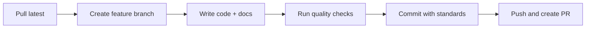

# Developer Onboarding Guide - SenialSOLIDApp

**Epic:** SSA-3 [EPIC-QUALITY] Mejoras de Calidad y Mantenibilidad
**Ticket:** SSA-27 - Code Documentation Standards
**Fecha:** 2025-09-24
**Versión:** 1.0
**Target Audience:** New developers joining the SenialSOLIDApp project

---

## 🎯 **Welcome to SenialSOLIDApp!**

This comprehensive guide will get you up and running as a productive team member on the **SenialSOLIDApp** signal processing system. Our application follows **Domain-Driven Design (DDD)** principles and maintains high code quality standards through comprehensive documentation and validation frameworks.

---

## 📋 **Table of Contents**

1. [Quick Start (30 min)](#quick-start)
2. [System Architecture Overview](#system-architecture-overview)
3. [Development Environment Setup](#development-environment-setup)
4. [Code Documentation Standards](#code-documentation-standards)
5. [Development Workflow](#development-workflow)
6. [Key Frameworks and Patterns](#key-frameworks-and-patterns)
7. [Common Tasks and Examples](#common-tasks-and-examples)
8. [Troubleshooting Guide](#troubleshooting-guide)
9. [Learning Resources](#learning-resources)
10. [Team Communication](#team-communication)

---

## ⚡ **Quick Start (30 min)**

### 1. **Environment Setup (10 min)**

```bash
# Clone repository
git clone <repository-url>
cd SenialSOLIDApp

# Setup Python environment
python -m venv venv
source venv/bin/activate  # Linux/Mac
# venv\Scripts\activate   # Windows

# Install dependencies
pip install -r requirements.txt

# Verify installation
python -m pytest tests/ -v
```

### 2. **Documentation Review (10 min)**

**Essential Reading Order:**
1. `README.md` - Project overview and basic setup
2. `docs/SSA-27_DOCUMENTATION_STANDARDS.md` - Our documentation rules
3. `docs/DOCSTRING_TEMPLATES.md` - Practical documentation examples
4. `CONTRIBUTING.md` - Contribution guidelines

### 3. **First Code Exploration (10 min)**

```bash
# Explore the domain layer (start here!)
ls dominio/modelo/
cat dominio/modelo/senial.py  # See our documentation standards in action

# Check application services
ls aplicacion/managers/
cat aplicacion/managers/controlador_adquisicion.py

# Run the web application
python presentacion/webapp/app.py
# Visit http://localhost:5000
```

**🎉 Congratulations! You now have a working development environment.**

---

## 🏗️ **System Architecture Overview**

### Domain-Driven Design Structure

```
SenialSOLIDApp/
├── 📁 dominio/              # 🔵 DOMAIN LAYER
│   ├── modelo/              # Entities, Value Objects, Aggregates
│   └── servicios/           # Domain Services
├── 📁 aplicacion/           # 🟢 APPLICATION LAYER
│   ├── managers/            # Application Services (Use Cases)
│   └── validation/          # Input Validation (SSA-24)
├── 📁 infraestructura/      # 🟡 INFRASTRUCTURE LAYER
│   ├── acceso_datos/        # Repositories, Data Access
│   └── externa/             # External Service Adapters
├── 📁 presentacion/         # 🔴 PRESENTATION LAYER
│   ├── webapp/              # Flask Web Interface
│   └── api/                 # REST API Endpoints
├── 📁 contenedor/           # Dependency Injection Container
├── 📁 config/               # Configuration Management
├── 📁 exceptions/           # Error Handling (SSA-26)
├── 📁 utilidades/           # Cross-cutting Utilities
└── 📁 docs/                 # Project Documentation
```

### Core Domain Concepts

| Concept | Description | Key Files |
|---------|-------------|-----------|
| **Señal (Signal)** | Core domain entity representing signal data | `dominio/modelo/senial.py` |
| **Adquisición** | Signal acquisition use case | `aplicacion/managers/controlador_adquisicion.py` |
| **Procesamiento** | Signal processing use case | `aplicacion/managers/controlador_procesamiento.py` |
| **Persistencia** | Repository pattern for data access | `infraestructura/acceso_datos/contexto.py` |

### Quality Frameworks Integration

- **SSA-24:** Input Validation and Security Framework
- **SSA-25:** Code Quality Metrics and Automation
- **SSA-26:** Comprehensive Error Handling Patterns
- **SSA-27:** Code Documentation Standards (this guide!)

---

## 🛠️ **Development Environment Setup**

### Prerequisites Checklist

- [ ] **Python 3.8+** installed
- [ ] **Git** configured with your credentials
- [ ] **IDE/Editor** with Python support (VS Code, PyCharm recommended)
- [ ] **Flask** familiarity (basic web framework knowledge)
- [ ] **DDD concepts** understanding (recommended reading below)

### Detailed Setup Steps

#### 1. **Python Environment**

```bash
# Check Python version
python --version  # Should be 3.8+

# Create isolated environment
python -m venv venv

# Activate environment
source venv/bin/activate  # Linux/Mac
venv\Scripts\activate     # Windows

# Upgrade pip
pip install --upgrade pip
```

#### 2. **Install Dependencies**

```bash
# Core dependencies
pip install -r requirements.txt

# Development dependencies (if exists)
pip install -r requirements-dev.txt

# Verify installation
python -c "import flask; print('Flask installed successfully')"
```

#### 3. **IDE Configuration**

**For VS Code:**
```json
// .vscode/settings.json
{
    "python.defaultInterpreterPath": "./venv/bin/python",
    "python.linting.enabled": true,
    "python.linting.pydocstyleEnabled": true,
    "python.formatting.provider": "black"
}
```

**For PyCharm:**
- Set Python interpreter to `./venv/bin/python`
- Enable pydocstyle inspection
- Configure Google style docstrings

#### 4. **Verify Setup**

```bash
# Run tests
python -m pytest tests/ -v

# Check documentation standards
pydocstyle dominio/modelo/senial.py

# Start development server
cd presentacion/webapp
python app.py
```

---

## 📝 **Code Documentation Standards**

> **CRITICAL:** All code MUST follow SSA-27 documentation standards. This is not optional!

### Documentation Hierarchy

| Priority | Component | Coverage Required | Style |
|----------|-----------|-------------------|-------|
| **P0** | Domain Entities | 100% | Google Style + Business Context |
| **P0** | Application Services | 100% | Google Style + Use Case Flow |
| **P1** | Infrastructure | 90% | Google Style + Technical Details |
| **P1** | Presentation Layer | 85% | Google Style + API Contracts |
| **P2** | Utilities | 80% | Google Style |

### Quick Documentation Checklist

Before committing ANY code:

- [ ] **Class docstring** with business purpose and context
- [ ] **Method docstrings** with Args, Returns, Raises, Examples
- [ ] **Type hints** on all public methods
- [ ] **Business language** used in domain layer
- [ ] **Error scenarios** documented with context
- [ ] **Examples** provided for complex operations

### Template Quick Reference

```python
# Domain Entity Template
class Senial(SenialBase):
    """Domain entity representing a signal in the signal processing system.

    Business Rules:
        - Signal capacity cannot exceed configured maximum
        - All values must be numeric
        - Signal ID must be unique
    """

    def poner_valor(self, valor: Union[int, float]) -> None:
        """Add measurement value to signal.

        Args:
            valor: Numeric measurement to add

        Raises:
            ValidationException: When signal is at capacity

        Example:
            >>> signal = Senial(tamanio=100)
            >>> signal.poner_valor(25.5)
        """

# Application Service Template
class ControladorAdquisicion:
    """Application service for signal acquisition operations.

    Use Cases Handled:
        - Signal acquisition from sources
        - Signal persistence
        - Signal retrieval and listing
    """

    def adquirir_senial(self) -> Senial:
        """Acquire signal from configured source.

        Returns:
            Senial: Newly acquired signal with metadata

        Raises:
            AcquisitionException: When acquisition fails
        """
```

---

## 🔄 **Development Workflow**

### Daily Development Cycle



### Branch Naming Convention

```bash
# Feature branches
git checkout -b feature/SSA-XX-brief-description

# Bug fixes
git checkout -b bugfix/SSA-XX-brief-description

# Hotfixes
git checkout -b hotfix/brief-description
```

### Commit Message Template

```bash
git commit -m "feat(SSA-27): Add comprehensive docstrings to domain layer

- Applied Google Style docstrings to Senial entity
- Added business context and DDD terminology
- Included type hints and error documentation
- Added usage examples for public APIs

Resolves SSA-27 documentation requirements for domain layer.

🤖 Generated with [Claude Code](https://claude.ai/code)

Co-Authored-By: Claude <noreply@anthropic.com>"
```

### Quality Gates (Run Before Each Commit)

```bash
# Documentation linting
pydocstyle dominio/ aplicacion/ infraestructura/ presentacion/

# Code formatting
black src/ --check

# Import sorting
isort src/ --check

# Run tests
python -m pytest tests/ -v --cov

# Type checking (if configured)
mypy src/
```

---

## 🔧 **Key Frameworks and Patterns**

### 1. **SSA-24: Input Validation Framework**

**Purpose:** Secure input validation and sanitization

```python
from aplicacion.validation import (
    ValidationError,
    StringInputValidator,
    validate_parameters
)

@validate_parameters(
    signal_id=StringInputValidator(max_length=50)
)
def process_signal(signal_id: str) -> ProcessingResult:
    """Process signal with validated input."""
```

### 2. **SSA-26: Error Handling Patterns**

**Purpose:** Comprehensive error handling with recovery strategies

```python
from exceptions import AcquisitionException, ValidationException
from exceptions.exception_handler import handle_with_recovery

try:
    result = handle_with_recovery(
        operation=acquisition_operation,
        operation_name="acquire_signal",
        context={"signal_id": signal_id},
        max_attempts=3
    )
except AcquisitionException as ae:
    logger.error("Acquisition failed", extra=ae.context)
    # Handle specific acquisition failure
```

### 3. **DDD Repository Pattern**

**Purpose:** Abstract data access from domain logic

```python
# Interface (implicit in Python)
class SenialRepository:
    def guardar(self, senial: Senial) -> None:
        """Store signal in repository."""

    def obtener(self, template: Senial, id_senial: str) -> Optional[Senial]:
        """Retrieve signal by ID."""

# Implementation
class ContextoPickle(BaseContexto):
    """Pickle-based repository implementation."""
```

### 4. **Dependency Injection Container**

**Purpose:** Manage dependencies and configurations

```python
from contenedor.configurador import Configurador

# Get configured services
adquisidor = Configurador.adquisidor
repository = Configurador.rep_adquisicion
processor = Configurador.procesador
```

---

## 💼 **Common Tasks and Examples**

### Task 1: Adding a New Domain Entity

```python
# 1. Create entity in dominio/modelo/
from typing import Union, List
from abc import ABCMeta, abstractmethod

class NuevaEntidad(BaseEntity):
    """New domain entity representing [business concept].

    Business Rules:
        - Rule 1: Business constraint description
        - Rule 2: Another important rule

    Attributes:
        property1: Business meaning of this property
        property2: Another important attribute
    """

    def __init__(self, param: str) -> None:
        """Initialize entity with required business data."""

    def business_operation(self, input: BusinessType) -> ResultType:
        """Perform core business operation."""
```

### Task 2: Creating Application Service

```python
# 2. Create service in aplicacion/managers/
class NuevoControlador:
    """Application service for [business area] operations.

    Use Cases Handled:
        - Use case 1: Description
        - Use case 2: Description

    Dependencies:
        repository: For entity persistence
        validator: For input validation
    """

    def execute_use_case(self, command: CommandType) -> ResultType:
        """Execute primary use case for [business operation]."""
```

### Task 3: Adding Web Endpoint

```python
# 3. Add endpoint in presentacion/webapp/views.py
@app.route("/api/nueva-operacion", methods=['POST'])
@handle_validation_errors
def api_nueva_operacion() -> tuple:
    """REST API endpoint for new operation.

    Request Format:
        {
            "field1": "value1",
            "field2": "value2"
        }

    Returns:
        tuple: (JSON response, HTTP status code)
    """
```

### Task 4: Writing Tests with Documentation

```python
# 4. Create test in tests/
def test_business_rule_enforcement(self):
    """Test that [business rule] is properly enforced.

    Verifies business constraint: [specific rule description]

    Test Scenarios:
        1. Valid operation succeeds
        2. Rule violation raises appropriate exception
        3. Error context includes business information
    """
```

---

## 🔧 **Troubleshooting Guide**

### Common Issues and Solutions

#### Issue 1: pydocstyle Errors

```bash
# Error: Missing docstring in public method
# Solution: Add Google Style docstring
def public_method(self) -> None:
    """Brief description of method purpose."""
```

#### Issue 2: Type Hint Problems

```bash
# Error: Missing return type annotation
# Solution: Add proper type hints
from typing import Optional, List

def get_signals(self) -> List[Senial]:
    """Get list of signals."""
```

#### Issue 3: Import Errors

```bash
# Error: Cannot import from domain
# Solution: Check Python path and virtual environment
source venv/bin/activate
export PYTHONPATH="${PYTHONPATH}:$(pwd)"
```

#### Issue 4: Flask App Won't Start

```bash
# Solution: Check configuration and dependencies
cd presentacion/webapp
export FLASK_ENV=development
python app.py
```

### Getting Help

1. **Documentation:** Check `docs/` directory first
2. **Code Examples:** Look at existing implementations
3. **Team Chat:** Ask in development channel
4. **GitHub Issues:** Create issue with `question` label

---

## 📚 **Learning Resources**

### Essential Reading (Priority Order)

#### Week 1 - Foundation
1. **Project Documentation**
   - `docs/SSA-27_DOCUMENTATION_STANDARDS.md`
   - `docs/DOCSTRING_TEMPLATES.md`
   - `CONTRIBUTING.md`

2. **Domain-Driven Design**
   - [Domain-Driven Design Quickly](https://www.infoq.com/minibooks/domain-driven-design-quickly/)
   - [DDD in Python](https://github.com/cosmicpython/book)

#### Week 2 - Technical Stack
3. **Flask Framework**
   - [Flask Quickstart](https://flask.palletsprojects.com/quickstart/)
   - [Flask Patterns](https://flask.palletsprojects.com/patterns/)

4. **Python Type Hints**
   - [PEP 484](https://www.python.org/dev/peps/pep-0484/)
   - [mypy documentation](https://mypy.readthedocs.io/)

#### Week 3 - Quality Standards
5. **Code Quality**
   - [Google Python Style Guide](https://google.github.io/styleguide/pyguide.html)
   - [Clean Code principles](https://clean-code-developer.com/)

### Hands-on Exercises

#### Exercise 1: Documentation Practice (30 min)
1. Find an undocumented function in `utilidades/`
2. Add comprehensive Google Style docstring
3. Include type hints and examples
4. Run `pydocstyle` to verify

#### Exercise 2: Simple Feature (2 hours)
1. Add a new method to `Senial` class
2. Write comprehensive documentation
3. Add unit tests with documentation
4. Create PR following our standards

#### Exercise 3: API Endpoint (3 hours)
1. Create new REST endpoint
2. Add input validation with SSA-24
3. Implement error handling with SSA-26
4. Document API contract completely

---

## 💬 **Team Communication**

### Communication Channels

| Channel | Purpose | Response Time |
|---------|---------|---------------|
| **GitHub Issues** | Bug reports, feature requests | 24h |
| **Pull Requests** | Code review discussions | 4h business hours |
| **Team Chat** | Quick questions, coordination | 1h business hours |
| **Email** | Formal communications | 48h |

### Meeting Schedule

- **Daily Standup:** 9:00 AM (15 min)
- **Sprint Planning:** Bi-weekly Monday (2h)
- **Code Review:** Weekly Wednesday (1h)
- **Architecture Discussion:** Monthly (2h)

### Code Review Guidelines

**As Author:**
- Ensure all quality gates pass
- Provide clear PR description
- Link to relevant documentation
- Respond to feedback promptly

**As Reviewer:**
- Focus on architecture and documentation
- Verify business logic correctness
- Check error handling patterns
- Validate test coverage

---

## ✅ **Onboarding Checklist**

### Week 1: Setup and Exploration
- [ ] Development environment set up successfully
- [ ] All essential documentation read
- [ ] First successful local application run
- [ ] Code exploration completed
- [ ] Basic Git workflow understood

### Week 2: First Contributions
- [ ] Documentation exercise completed
- [ ] First simple feature implemented
- [ ] PR created following standards
- [ ] Code review process experienced
- [ ] Team communication established

### Week 3: Full Integration
- [ ] Complex feature implementation
- [ ] API endpoint created with full documentation
- [ ] Quality gates mastered
- [ ] Mentoring session completed
- [ ] Independent contribution confidence

### Week 4: Team Member
- [ ] Architecture discussions participation
- [ ] Code review providing for others
- [ ] Documentation contributions
- [ ] Process improvement suggestions
- [ ] Full team integration achieved

---

## 🎯 **Success Metrics**

You'll know you're successful when:

### Technical Metrics
- ✅ All code you write passes documentation linting
- ✅ Your PRs require minimal review cycles
- ✅ You can navigate the codebase confidently
- ✅ Your code follows DDD patterns correctly

### Team Integration Metrics
- ✅ You participate actively in team discussions
- ✅ You provide helpful code review feedback
- ✅ You contribute to documentation improvements
- ✅ You mentor newer team members

### Business Impact Metrics
- ✅ Your features align with business requirements
- ✅ Your error handling provides good user experience
- ✅ Your documentation helps other developers
- ✅ Your code is maintainable and extensible

---

## 🔄 **Next Steps After Onboarding**

### Advanced Learning Path
1. **Domain Expert:** Deep dive into signal processing domain
2. **Architecture Leader:** Contribute to architectural decisions
3. **Quality Champion:** Help improve our quality standards
4. **Mentor:** Help onboard future team members

### Contribution Areas
- **Feature Development:** New signal processing capabilities
- **Documentation:** Improve and expand our documentation
- **Quality Improvement:** Enhance our quality frameworks
- **Performance:** Optimize signal processing algorithms

---

## 📞 **Support and Feedback**

### Getting Support
- **Immediate Help:** Team chat or pair programming
- **Technical Issues:** GitHub issues with detailed description
- **Process Questions:** Team lead or senior developer
- **Career Development:** Manager or HR representative

### Providing Feedback
We value your feedback on this onboarding process:
- **What worked well?** Help us keep the good parts
- **What was confusing?** Help us improve clarity
- **What was missing?** Help us fill gaps
- **What would you change?** Help us optimize the experience

### Feedback Channels
- Anonymous feedback form: [internal link]
- Direct to team lead: [contact info]
- HR feedback session: Scheduled week 4
- Team retrospective: Bi-weekly

---

## 📝 **Document History**

| Date | Version | Changes | Author |
|------|---------|---------|--------|
| 2025-09-24 | 1.0 | Initial developer onboarding guide creation | Victor Valotto |

---

## 🎉 **Welcome to the Team!**

You're now equipped with everything you need to be successful on the SenialSOLIDApp team. Remember:

- **Documentation is not optional** - it's how we maintain quality
- **Ask questions early and often** - we're here to help
- **Focus on business value** - understand the domain deeply
- **Quality first** - build things right the first time

**We're excited to see what you'll build! 🚀**

---

*This guide is part of SSA-27 implementation and will be updated based on team feedback and evolving standards.*